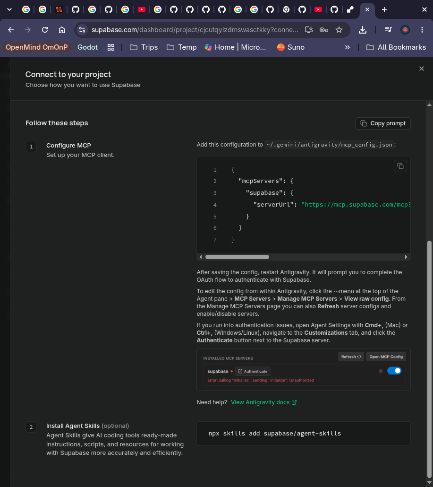

# MirrorMarch 󰐱

> High-performance display mirroring, second-screen iPad extension, and remote desktop control for [Omarchy](https://omarchy.org/) Linux on Hyprland.



---

## 🌟 Overview

**MirrorMarch** is an official-style Omarchy bar plugin and background service that turns your iPad, tablet, phone, or any modern web browser into a wireless second monitor or interactive remote desktop for your Linux machine.

Whether you need extra screen real estate on the go, want to mirror your desktop for presentations, or want full touch-friendly remote control of your Omarchy workspace from across the room, MirrorMarch delivers ultra low-latency streaming and full input injection.

---

## ✨ Features

### 🖥️ Three Operating Modes
- **󰍹 Mirror Mode**: Clones your active primary display (`DP-1` / `eDP-1`) in real-time with zero configuration.
- **󰐱 Extend Mode**: Dynamically provisions a virtual headless display (`HEADLESS-1`) configured to your tablet's exact native resolution, providing a true separate workspace for multitasking.
- **󰢹 Remote Desktop Mode**: Full interactive control over your Omarchy desktop with specialized on-screen controls, virtual key combos, and touch gestures.

### 📱 Touch-First Mobile & Tablet Experience
- **Direct Touch & Trackpad**: Switch between direct tap-to-click / drag and smooth laptop-style trackpad navigation.
- **Remote Desktop Toolbar**:
  - **Quick Hyprland Shortcuts**: One-tap triggers for App Launcher (`Super+Space`), Terminal (`Super+Return`), and Close Window (`Super+W`).
  - **Latched Modifiers**: Sticky on-screen modifier keys (`Super`, `Ctrl`, `Alt`, `Shift`) to execute complex window manager key combinations.
  - **Window Drag & Select**: Dedicated Drag Mode button to easily move tiled/floating windows and select text.
  - **Quick Keys**: On-screen Tab and Escape keys for quick terminal navigation.
  - **Clipboard Paste**: Send text or clipboard contents straight to the active Linux application.
- **Touch Ripple Feedback**: Real-time visual ripples on screen touches.
- **Always-On Display**: Uses the Screen Wake Lock API to prevent mobile displays from dimming or locking during a session.
- **Virtual Keyboard**: Tap to summon your device's native on-screen keyboard to type into any Linux terminal or editor.

### ⚡ Tunable Performance & Low Latency
- **Real-time Streaming**: Powered by WebSockets and high-throughput hardware capture.
- **Dynamic Quality Switching**: Toggle between `Speed` (45% quality, 40 FPS), `Balanced` (65% quality, 30 FPS), and `HQ` (85% quality, 20 FPS) presets on the fly directly from the viewer HUD.
- **Hardware-Accelerated Canvas**: Uses `createImageBitmap` on an HTML5 canvas for smooth 30–60 FPS output.

### 🎨 Native Omarchy Bar Widget (`Widget.qml`)
- **Status Bar Indicator**: Live glyph showing connection status, active mode, and real-time FPS counter.
- **One-Click Fast Toggle**: Right-click the bar icon to instantly start or stop streaming.
- **Interactive Popup**: Left-click to reveal the control panel with mode selectors, settings, and a scannable QR code.
- **Keyboard Shortcuts**: Navigate the widget popup with `Space` (toggle), `M` (mirror), `E` (extend), `R` (remote), `O` (open viewer), or `Esc` (dismiss).

### 🔐 Built-in Authentication
- Secure authentication system protecting your display stream.
- Seamless sign-up and sign-in directly within the web interface without email verification friction.

---

## 📦 Installation & Removal

### Installation
Install MirrorMarch directly through the Omarchy plugin manager:

```bash
omarchy plugin add https://github.com/MichaelCodeToLimit/omarchy-mirror-screen.git --enable
```

Or clone manually:

```bash
git clone https://github.com/MichaelCodeToLimit/omarchy-mirror-screen.git ~/.config/omarchy/plugins/michael.mirrormarch
omarchy plugin enable michael.mirrormarch
```

### Removal / Uninstallation
To disable or completely remove MirrorMarch:

```bash
# Disable without deleting
omarchy plugin disable michael.mirrormarch

# Completely remove
omarchy plugin remove michael.mirrormarch
```

### Dependencies
MirrorMarch relies on tools standard on Omarchy:
- **`grim`**: High-performance Wayland image capture utility.
- **`wtype`**: Wayland virtual keyboard and shortcut input simulation.
- **`hyprland` / `hyprctl`**: Wayland compositor control and virtual headless monitor creation.
- **`node`** (v18+) & **`python3`**: Runtime engines for the local background service and input injector.

---

## 🚀 Getting Started

1. **Start Streaming**:
   Click the MirrorMarch icon in your Omarchy bar and press **Start Streaming**, or use the CLI:
   ```bash
   # Mirror primary monitor
   mirrormarch start --mode mirror

   # Extend as a second iPad screen
   mirrormarch start --mode extend

   # Interactive remote desktop
   mirrormarch start --mode remote
   ```

2. **Connect Your Device**:
   - Open the MirrorMarch widget popup to view your device connection QR code.
   - Scan the QR code with your iPad or phone camera to open the web viewer.
   - Sign in or create an account, and your screen will appear immediately!

---

## 💻 CLI Commands

MirrorMarch includes a full CLI utility:

```bash
# Start background daemon
mirrormarch start [--mode mirror|extend|remote] [--fps 30] [--quality 65]

# Stop streaming and clean up virtual displays
mirrormarch stop

# Toggle streaming state on/off
mirrormarch toggle

# Switch directly to Remote Desktop mode
mirrormarch remote

# Check daemon status and active configuration
mirrormarch status

# Display connection QR code in terminal
mirrormarch qrcode

# Open viewer in your default web browser
mirrormarch open
```

---

## ⌨️ Widget Keyboard Shortcuts

When the Omarchy bar popup widget is focused:

| Key | Action |
| :--- | :--- |
| `Space` / `S` | Toggle streaming on/off |
| `M` | Switch to Mirror mode |
| `E` | Switch to Extend (virtual monitor) mode |
| `R` | Switch to Remote Desktop mode |
| `O` | Open viewer in local browser |
| `Q` / `Esc` | Close widget popup |

---

## 📜 License

MIT License © 2026 Michael Davies
